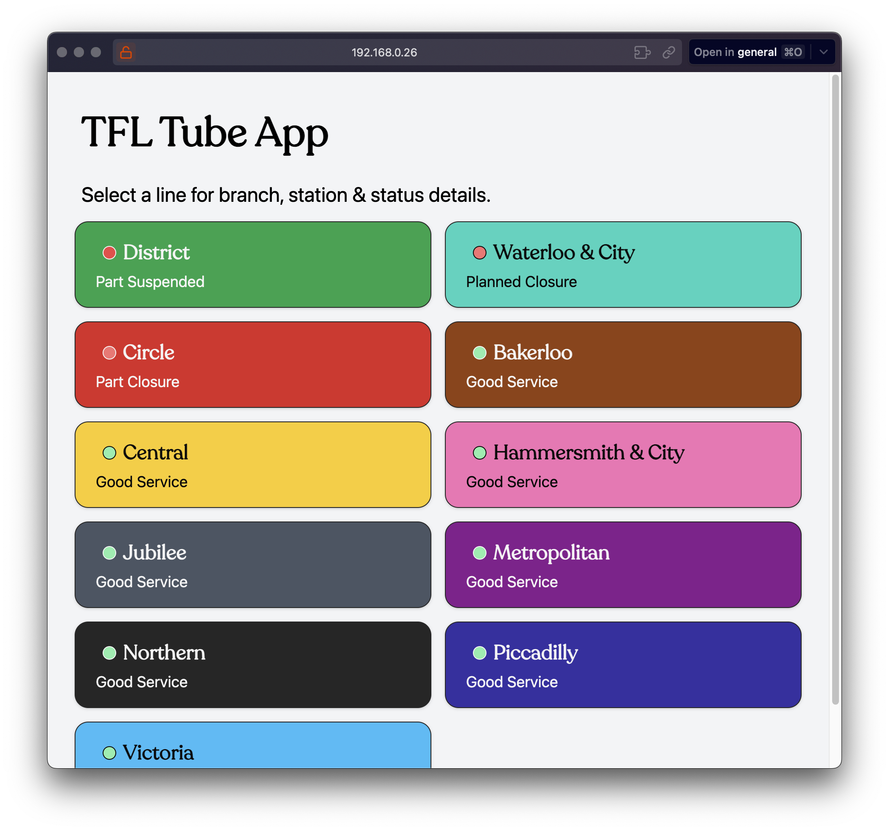

# TFL Tube App

This is an app I made for a technical submission. The main requirements were:

- It should be a mobile-oriented full-stack web app.
- The status of London underground lines should be shown.
- Selecting a line should show the branches and stops on that line.
- The preferred stack is React, NodeJS and Typescript.
- It should take around three hours (but you can go over if you wish).

I was also told to leverage [TFL's Unified API](https://api.tfl.gov.uk/) for data.

## To run it

To run the app follow these instructions:

- Open your terminal and navigate into the project file.
- Run `yarn` to install dependencies.
- Run `yarn build` to build the app.
- Run `yarn start` to serve the built files.
- Go to http://localhost:3000 in your browser to see what I did.

Alternatively, you can run `yarn dev` to serve it in dev mode.

## The stack I used

In the initial "vibe-check" interview, it was suggested that some knowledge of backend would be preferable. Also, NodeJS was right there in the requirements. So, I did some discovery; I span up a little project using NodeJS, TypeScript, Express & Axios to call the TFL API. It was fun, but that's about it. Backend, as much as I love it, is not my strong-point, I'm happy to do it but I wouldn't be doing it as well as a seasoned BE-dev who recoils at the mere mention of DOMs or hooks.
I also realised that making the server would just cause a load of duplication and tech-debt to accrue; I'd just be catching data and forwarding it to the FE. Sure, I could use a BE to change the data from doctor's handwriting to something easier for my FE to consume but these operations aren't that expensive; they're not occurring on the DOM, the values required can be pulled out instantaneously, so why add latency and complexity?

### Remix

I decided to use Remix to give me some _server-feel_ with loaders, routing & SSR. When a user navigates to the app I could call the endpoints and pop the data straight into the page. It also means that if a user wants to bookmark a specific line's URL, they can. The data will always fetch when the page is loaded/re-loaded.
Remix is also fast and I'm nominally familiar with it; three hours is not a long time and `npx create-remix@latest` come loaded with React, Vite & Tailwind so no need to call a plumber either.

### Vite

As a meta-framework I used Vite because I like it. It's minimal(-ish), not overly-opinionated and plays nice with Remix & Tailwind. I've used it before. I like its plugins, it can build and serve my CV free on Github-Pages so it was an obvious choice for me.

### Tailwind

Tailwind is great for this sort of project. It allows me to style my pages and components quickly, using inline-styles. It's got great documentation, it biases mobile-first (so you'll have to specify different styles for bigger breakpoints(look for `md:` in the code and you'll see what I mean)) and makes centering elements laughably simple.

### Typescript

I know the Zen of Python says "Explicit is better than implicit" but that's Python, not TS. In my opinion TS works best when things are implicit. I do not like casting and I don't putting `|| ""` in my code, I'll only do them if I absolutely have no other option. TS should almost always be able to infer what's going on. If it can't that's a code smell, you might be doing something wrong. That's how I use TS.
